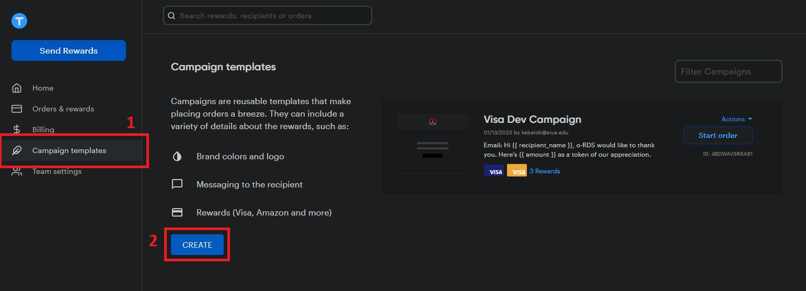
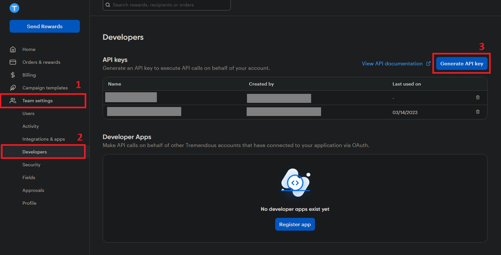
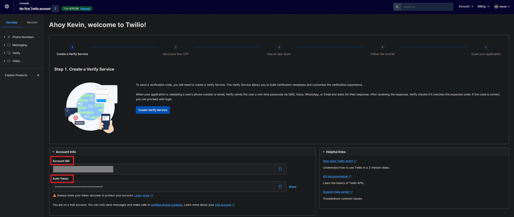
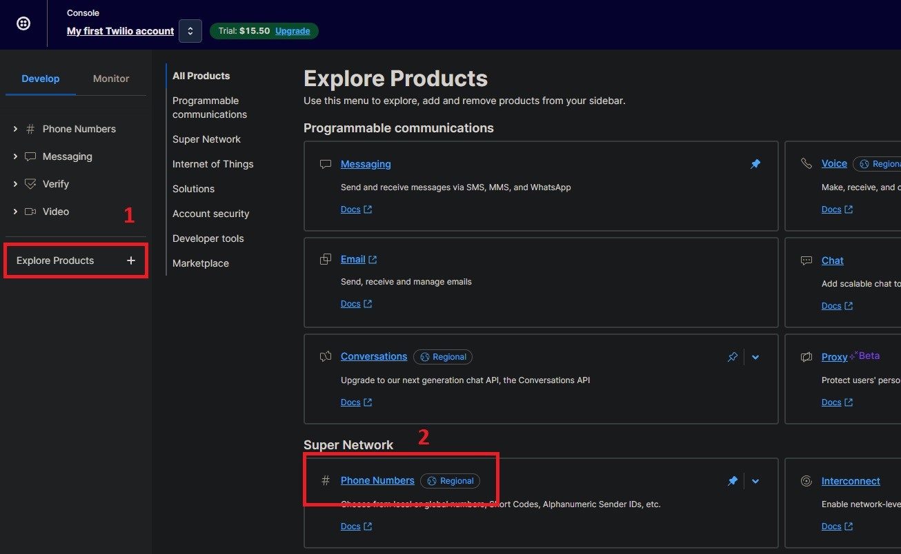
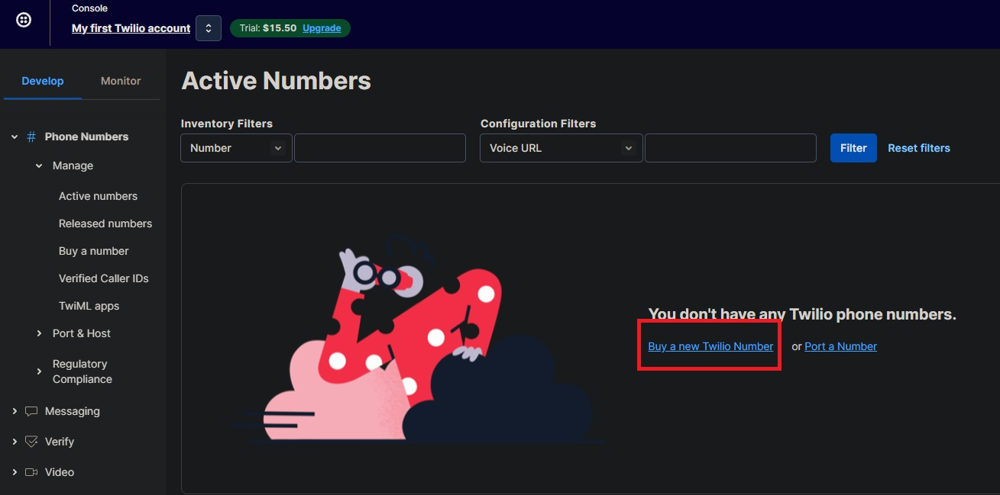

# Incentive Payment and Phone Verification Setup

For incentive payment methods, o-RDS currently supports:

    Tremendous

For mobile phone verification, o-RDS currently supports:

    Twilio

Below is a step-by-step guide detailiing how to setup o-RDS to work your selected payout and phone verification methods. 

## Tremendous Step 0: Create an Account

Go to [Tremendous.com](https://www.tremendous.com/) and create an account. Tremendous requires you to use a "business email domain only." Once you have created an account, move on to step 1. 

Don't worry about adding funds just yet. Tremendous has a wonderful development environment called "Testflight", which will be of great use. 

## Tremendous Step 1: Testflight

[Testflight](https://testflight.tremendous.com/) is a way for you to use Tremendous services in a development environment without worry of using any real money. You can think of Tremendous Testflight as an identical version of Tremendous which provides your account with $5000 that renews periodically. For the purposes of testing, we recommend strictly utilizing Testflight. Once o-RDS is prepared for production use, switch over your Bearer token and Tremendous URL environment variables (step 4). 

Click [HERE](https://developers.tremendous.com/docs/sandbox-environment) to get more informatin about Testflight. 

## Tremendous Step 2: Create a Campaign

Campaign templates will allow you to select which rewards you want to make available to your recepients, as well as design the look of the message your recepients receive. Below shows you how to navigate to create a campaign template:

## Tremendous Step 3: Get your Bearer Token

Bearer tokens are what Tremendous uses to authorize API calls. It is important that these keys remain secret. If you ever accidentaly expose your API key, be sure to quickly create a new one and remove any use of the old key from o-RDS. More information on what to do with this key is detailed in step 4. 

## Tremendous Step 4: Set Up Environment Variables

Environment variables are used to keep secrets from being used as plaintext within the codebase. Envrionment files contain the key-value pairs that are associated with the secrets that need to be used in the code. o-RDS provides an empty environment variable file with only the keys, and all you need to do is get your values and fill out the file. Once .env.development is filled out with values, change the name to "**.env**" and gitignore will ignore it upon the next commit. 

In the case of Tremendous, the only values required in the .env file are: 

    TREMENDOUS_BEARER_TOKEN=TEST_...

and 

    TREMENDOUS_SERVER=https://testflight.tremendous.com

**Notice** how SERVER is set to the testflight URL. Once you're ready to switch to production, simply change this to Tremendous's URL to: https://www.tremendous.com

Where you decide to host this server will change how you handle these environment variables in a production setting. For o-RDS's original testing, we hosted on [Railway](https://railway.app/). Sites like this and many others provide a place for you input the same key-value pairs that are used in your environment files. In Railway, for example, these are called "[Variables](https://docs.railway.app/develop/variables)". 

### Note
These docs outline how to get a Tremendous account working with o-RDS. For detailed information on how Tremendous's API endpoints work, such as the ones that are being used in this server, please refer to the [Tremendous Developer Docs](https://developers.tremendous.com/docs/introduction).

## Twilio Step 0: Create an Account

Go to [Twilio.com](https://www.twilio.com/?g=%2F) and create your account. Once you've verified your email and phone number, you'll end up at Twilio's console (below). Here you'll find your Account SID and Auth Token. You'll need these in the following steps. 

## Twilio Step 1: Buy a Twilio Phone Number

o-RDS does not use Twilio's verification service. Instead, we use a phone number and send verification texts on our own. You'll need to purchase a phone number with Twilio. To do this, follow the steps below. 

Take a note of the phone number you choose, as you'll need this in setting up your environment variables (step 2).

## Twilio Step 2: Set Up Environment Variables 

Similar to Tremendous step 4, we are now ready to set up our environment variables. This time there are 4:

    TWILIO_AUTH_TOKEN=
    TWILIO_ACCOUNT_SID=
    TWILIO_PHONE_NUMBER=
    TWILIO_SERVER=https://verify.twilio.com

Unlike Tremendous, we don't need to worry about different server URLs for dev vs production, but it's here for consistency. 

We have provided a blank environment file ([.env.development](../.env.development)) which has all the necessary keys, but just needs the values. Once you've filled out all the neceesary fields, change the name to "**.env**" and gitignore will ignore it upon the next commit. 